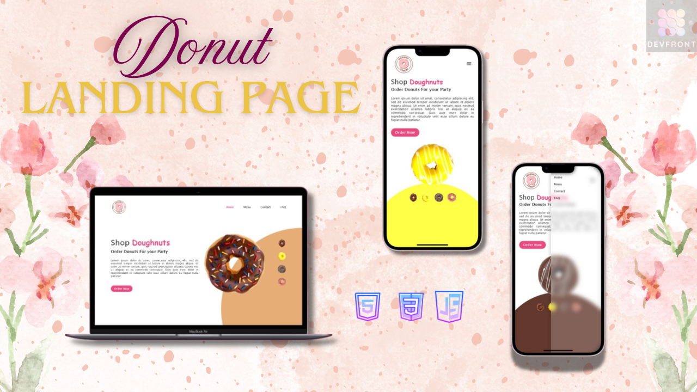
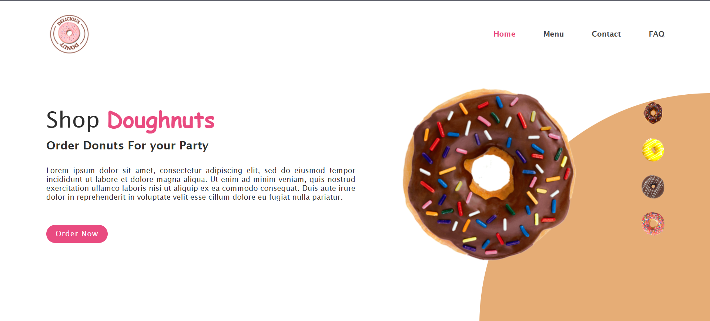

```markdown
# 🍩 Donuts Landing Page

A vibrant and responsive landing page designed to promote a donut shop, complete with product visuals, animations, and an engaging UI.

## 🖼 Preview

 

## 🚀 Features

- 🍩 Interactive donut image switching
- 🎨 Dynamic background color change
- 📱 Fully responsive layout
- 🧭 Navigation menu with mobile sidebar toggle
- 💅 Sleek and modern CSS styling

## 🛠️ Technologies Used

- HTML5
- CSS3
- JavaScript (Vanilla)

## 📂 File Structure

```
├── Index.html        # Main HTML file
├── Styles.css        # Styling for the layout
├── Script.js         # Interactivity (image switch, background color, sidebar)
├── /images           # Donut images 
```

## 🧠 How It Works

- Clicking a donut thumbnail changes the main donut image and background color.
- The mobile menu toggles using a sidebar triggered by a menu icon.
- Smooth hover effects and transitions enhance the user experience.

## 📱 Responsive Design

The layout adjusts seamlessly for various screen sizes:
- Desktop: Flexbox layout with content and product image side-by-side
- Mobile: Stack layout with collapsible sidebar navigation

## 🧩 How to Use

1. Clone the repository:

```bash
git clone https://github.com/yourusername/donuts-landing-page.git
cd donuts-landing-page
```

2. Open `Index.html` in your browser.

3. (Optional) Add your own images to replace the donut visuals:
   - `Choco_sprinkles.png`
   - `Yellow_glazed.png`
   - `chocolate.png`
   - `Strawberry.png`

## ✨ Customization

You can tweak:
- Colors by editing `Styles.css`
- Images by replacing the donut image files
- Text and content directly in `Index.html`

## 📸 Screenshots

 

## 📄 License

MIT License. Feel free to use and customize as you like.

---

Enjoy your sweet landing page! 🍩
```
